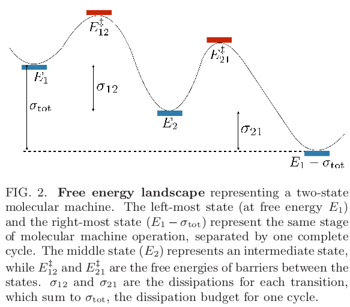

## Theory

### [@arxiv:1703.05283v3]
These authors claim that maximizing the flux results in minimizes the free energy wells of intermediate metastable states. 

The forward rate constants from state $i$ to $j$ are $k^{+}_{ij}$ and these are reversible transitions. The is $k^{+}_{ij} P_{i}$, where $P_{i}$ is the probability in bin (or state) $i$. There is a total free energy budget $\sigma_\text{tot}$ that describes the free energy difference across the cycle. This seems a little strange to me, but perhaps this is the same as saying the free energy from ATP hydrolysis is what drives each cycle.

A corollary of their central claim is that when barriers are lower, transitions are faster, and flux increases. The authors also claim that flux is maximized by reducing the number of metastable states, i.e., turning a three state system into a two state system. 

### [@url:http://science.sciencemag.org/content/sci/356/6341/964]
A new synchronous rotary molecular motor from Feringa's group. 
